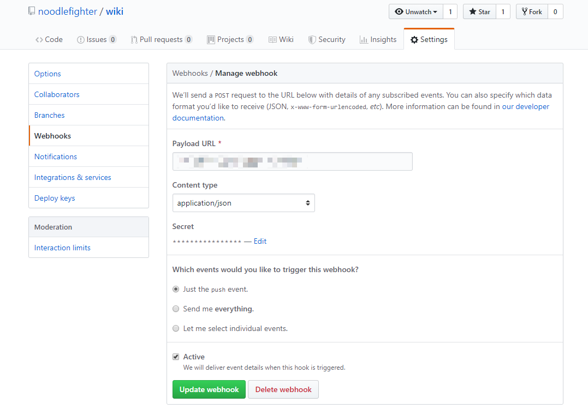

# githook

**Simply** Github Webhook Server implement in Golang, powered by [go-playground/webhooks](https://github.com/go-playground/webhooks/tree/v5.11.0).


## Usage

dependent install: 

```
go get -u gopkg.in/go-playground/webhooks.v5
```

setup your github repo:

* URL: default port 3000, exp. "http://111.222.1.1:3000"
* Content type: application/json
* Secret 



Prepare your bash script:

```
./[github repo path]/[event].sh
```

For example,  [「noodlefighter/wiki」](https://github.com/noodlefighter/wiki)'s "push" event corresponding --->`./noodlefighter/wiki/push.sh`.

```
# tree
.
|-- githook.go
|-- noodlefighter
|   `-- wiki
|       `-- push.sh
|-- README.md
`-- run_githook.sh

```

run:

```
./run_githook.sh [your secret]
```

